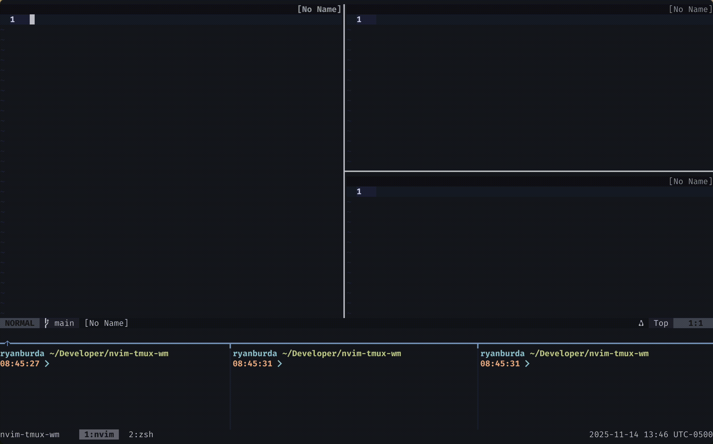

# nvim-tmux-wm

A unified window manager for Neovim and tmux.

Navigate and resize seamlessly across Neovim splits and tmux panes as if they were a single application.



## Navigation

Navigation works seamlessly across Neovim and tmux boundaries.
The default navigation keys are:
- `<C-h>` navigate left
- `<C-j>` navigate down
- `<C-k>` navigate up
- `<C-l>` navigate right

These keybindings work seamlessly across Neovim and tmux boundaries, creating a
fluid navigation experience where you never have to think about whether you're
moving within Neovim or between tmux panes.

## Resizing

This plugin implements an intuitive split resizing experience that differs from stock Neovim and tmux behavior.
The default resizing keys are:
- `<A-h>` resize left
- `<A-j>` resize down
- `<A-k>` resize up
- `<A-l>` resize right

### How It Works

The resize implementation **prioritizes making splits bigger by expanding in a direction**. Think of
it as standing inside your current pane and pushing the border in the specified direction outward to
expand the current split. A split will attempt to grow in the specified direction unless it is up
against the outermost terminal window, in which case it will shrink from the opposite direction.

When you resize:
1. **First priority**: The current split tries to grow by taking space from a neighbor in the direction you specify
2. **Fallback**: If direction specified is already touching the edge of the container (terminal window), the split will shrink from the opposite direction instead
3. **Smart boundaries**: A Neovim split will never resize a tmux pane if there's another Neovim split it can take space from.
### Example

If you have splits arranged like this:
```
┌─────┬─────┐
│  A  │  B  │
├─────┼─────┤
│  C  │  D  │ ← You are here
└─────┴─────┘
```

When you press `<A-k>` (resize up) from split D:
- Split D will grow upward, taking space from split B
- The border between B and D moves up, making D larger

When you press `<A-j>` (resize down) from split D:
- Split D will shrink downward, giving more room to split B
- The border between B and D moves down, making D smaller
- This occurs because the bottom border of D is already touching
the bottom border of the entire window and thus cannot go down
any further

When you press `<A-h>` (resize left) from split D:
- Split D will grow to the left, taking space from split C
- The border between D and C moves to the left, making D larger

When you press `<A-l>` (resize right) from split D:
- Split D will shrink to the right, giving more room to split C
- The border between D and C moves to the right, making D smaller
- This occurs because the right border of D is already touching
the right border of the entire window and thus cannot go to the
right any further


In a more complicated case:
```
┌─────────────┐
│      A      │
├─────────────┤
│      B      │ ← You are here
├─────────────┤
│      C      │
└─────────────┘
```

Split B is does not touch the either the top or bottom of the terminal window.

When you press `<A-k>` (resize up) from split B:
- Split B will grow upward, taking space from split A
- The border between B and A moves up, making B larger

When you press `<A-j>` (resize down) from split B:
- Split B will grow downward, taking space from split C
- The border between B and C moves down, making B larger

Notice that in this case, both resizing up and down made split B larger (unlike
in the first example where one direction grew and the other shrank). This is what
we mean by **prioritizing making splits bigger** - the plugin always attempts to
grow your current split first, regardless of direction.

This creates a more intuitive resizing experience where your action directly
corresponds to growing your current workspace in the direction you specify.


# Configuration

`nvim-tmux-wm` is both a neovim plugin and a tmux plugin. As a result
we'll need to configure both ends in order to get things working.

**Why configure both Neovim and Tmux?**

This plugin requires configuration in both tmux and Neovim because they each
handle keybindings separately and our goal is to provide a unified experience:

- **Tmux side**: Tmux intercepts all keypresses first. The tmux configuration detects if the active pane
is running Neovim, and if so, passes the keypress through to Neovim. Otherwise, tmux handles the
navigation/resize itself.
- **Neovim side**: The plugin needs to be installed so Neovim can handle navigation/resize commands and
communicate with tmux when you're at a window edge.

Without the tmux configuration, your keypresses would only work within Neovim and wouldn't navigate to
tmux panes. Without the Neovim plugin, navigation from tmux into Neovim would work, but you couldn't
navigate back out to tmux panes from within Neovim.

## Neovim Setup

### Installation

#### Using [vim.pack](https://neovim.io/doc/user/lua.html#vim.pack)

```lua
vim.pack.add({ 'https://github.com/ryanburda/nvim-tmux-wm' })
```

#### Using [lazy.nvim](https://github.com/folke/lazy.nvim)

```lua
{ 'ryanburda/nvim-tmux-wm' }
```

### Recommended Keymaps

Add these keymaps to your Neovim config for seamless navigation:

```lua
-- Navigation
vim.keymap.set('n', '<C-h>', '<cmd>NvimTmuxNavigateLeft<cr>')
vim.keymap.set('n', '<C-j>', '<cmd>NvimTmuxNavigateDown<cr>')
vim.keymap.set('n', '<C-k>', '<cmd>NvimTmuxNavigateUp<cr>')
vim.keymap.set('n', '<C-l>', '<cmd>NvimTmuxNavigateRight<cr>')

-- Resizing (optional)
vim.keymap.set('n', '<A-h>', '<cmd>NvimTmuxResizeLeft<cr>')
vim.keymap.set('n', '<A-j>', '<cmd>NvimTmuxResizeDown<cr>')
vim.keymap.set('n', '<A-k>', '<cmd>NvimTmuxResizeUp<cr>')
vim.keymap.set('n', '<A-l>', '<cmd>NvimTmuxResizeRight<cr>')
```

## Tmux Setup

The tmux configuration needs to know where to find the [resize script](./scripts/resize_tmux_pane.sh)
that implements the resizing logic. This script is bundled with the Neovim plugin (rather than being
copy-pasted into your tmux config) to ensure both Neovim and tmux use identical, version-controlled
resize behavior. This ensures the window manager experience is kept consistent with future releases.

After installing the plugin with your Neovim package manager, update the `NVIM_TMUX_RESIZE_SCRIPT`
path in the configuration below to point to where the plugin was installed.

Add this configuration to your `~/.tmux.conf`:
```sh
################
# nvim-tmux-wm #
################
# NOTE: Update the path to match where you cloned this plugin (This should work for lazy.nvim)
#         |
#         |
#         V
NVIM_TMUX_RESIZE_SCRIPT="$HOME/.local/share/nvim/lazy/nvim-tmux-wm/scripts/resize_tmux_pane.sh"

is_vim="ps -o tty= -o state= -o comm= | grep -iqE '^#{s|/dev/||:pane_tty} +[^TXZ ]+ +(\\S+\\/)?g?(view|l?n?vim?x?|fzf)(diff)?$'"

# Navigation bindings
bind-key -n 'C-h' if-shell "$is_vim" 'send-keys C-h' 'select-pane -L'
bind-key -n 'C-j' if-shell "$is_vim" 'send-keys C-j' 'select-pane -D'
bind-key -n 'C-k' if-shell "$is_vim" 'send-keys C-k' 'select-pane -U'
bind-key -n 'C-l' if-shell "$is_vim" 'send-keys C-l' 'select-pane -R'

# Resize bindings
bind-key -n 'M-h' if-shell "$is_vim" 'send-keys M-h' "run-shell -b '$NVIM_TMUX_RESIZE_SCRIPT L 3'"
bind-key -n 'M-j' if-shell "$is_vim" 'send-keys M-j' "run-shell -b '$NVIM_TMUX_RESIZE_SCRIPT D 1'"
bind-key -n 'M-k' if-shell "$is_vim" 'send-keys M-k' "run-shell -b '$NVIM_TMUX_RESIZE_SCRIPT U 1'"
bind-key -n 'M-l' if-shell "$is_vim" 'send-keys M-l' "run-shell -b '$NVIM_TMUX_RESIZE_SCRIPT R 3'"

# Legacy tmux version support for navigation
tmux_version='$(tmux -V | sed -En "s/^tmux ([0-9]+(.[0-9]+)?).*/\1/p")'
if-shell -b '[ "$(echo "$tmux_version < 3.0" | bc)" = 1 ]' "bind-key -n 'C-\\' if-shell \"$is_vim\" 'send-keys C-\\'  'select-pane -l'"
if-shell -b '[ "$(echo "$tmux_version >= 3.0" | bc)" = 1 ]' "bind-key -n 'C-\\' if-shell \"$is_vim\" 'send-keys C-\\\\'  'select-pane -l'"

# Copy mode bindings
bind-key -T copy-mode-vi 'C-h' select-pane -L
bind-key -T copy-mode-vi 'C-j' select-pane -D
bind-key -T copy-mode-vi 'C-k' select-pane -U
bind-key -T copy-mode-vi 'C-l' select-pane -R
####################
# end nvim-tmux-wm #
####################
```

## Usage

After following the steps above, restart Neovim and tmux for the changes to take effect.

This plugin is best experienced through keymaps that unify the experience between Neovim and tmux.
Since tmux sends keys to Neovim it is rare that you will actually use the Neovim specific
navigation or resize commands directly.

### User Commands

The following user commands are available:

**Navigation:**
- `:NvimTmuxNavigateLeft` - Move to the left split/pane
- `:NvimTmuxNavigateDown` - Move to the split/pane below
- `:NvimTmuxNavigateUp` - Move to the split/pane above
- `:NvimTmuxNavigateRight` - Move to the right split/pane

**Resizing:**
- `:NvimTmuxResizeLeft [amount]` - Resize left by `amount` (default: 5)
- `:NvimTmuxResizeDown [amount]` - Resize down by `amount` (default: 5)
- `:NvimTmuxResizeUp [amount]` - Resize up by `amount` (default: 5)
- `:NvimTmuxResizeRight [amount]` - Resize right by `amount` (default: 5)

Example with custom amount:
```vim
:NvimTmuxResizeLeft 10
```

### Lua API

You can also use the Lua API directly:

```lua
local navigator = require('nvim-tmux-wm')

-- Move in a direction ('h', 'j', 'k', or 'l')
navigator.move('h')  -- Move left
navigator.move('j')  -- Move down
navigator.move('k')  -- Move up
navigator.move('l')  -- Move right

-- Resize in a direction with a specific amount
navigator.resize('h', 10)  -- Resize left by 10
navigator.resize('j', 5)   -- Resize down by 5
navigator.resize('k', 5)   -- Resize up by 5
navigator.resize('l', 10)  -- Resize right by 10
```

## License

MIT
