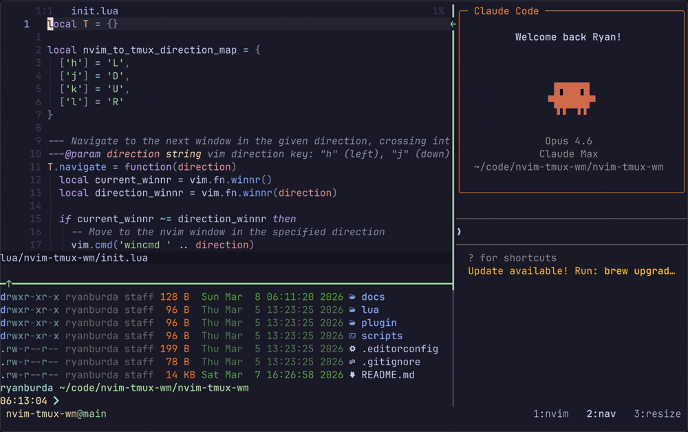
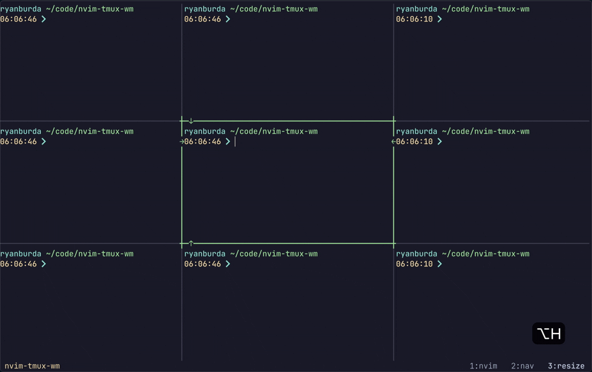

# nvim-tmux-wm

A unified window manager for Neovim and tmux.

Navigate and resize seamlessly across Neovim splits and tmux panes as if they were a single application.

### Navigation


### Resize


> **Note:** All keymaps shown throughout this README are suggestions, not requirements.
> Nothing in the plugin implementation on either the Neovim or tmux side is bound to
> any specific keymap. You are free to use whatever keys you prefer. The only thing that
> matters is that your Neovim and tmux keymaps work together so the experience is seamless.

## Navigation

Navigation works seamlessly across Neovim and tmux boundaries.
The default navigation keys are:
- `<C-h>` move left
- `<C-j>` move down
- `<C-k>` move up
- `<C-l>` move right

These keybindings work across Neovim and tmux boundaries, creating a fluid navigation experience
where you never have to think about whether you're moving within Neovim or between tmux panes.

## Resizing

This plugin implements an intuitive split resizing experience that differs from stock Neovim and tmux behavior.
Each resize operation moves a **specific border** of the current split in a **specific direction**.
- `Alt + <hjkl>` keybinds move the border in the direction that grows the current split
- `Alt + <HJKL>` keybinds move the border in the direction that shrinks the current split

The default resizing keys are:
- `<A-h>` move left border left (grow)
- `<A-H>` move left border right (shrink)
- `<A-j>` move bottom border down (grow)
- `<A-J>` move bottom border up (shrink)
- `<A-k>` move top border up (grow)
- `<A-K>` move top border down (shrink)
- `<A-l>` move right border right (grow)
- `<A-L>` move right border left (shrink)

### Why Not Stock Resizing?

Stock Neovim (`resize +N / vertical resize +N`) and tmux (`resize-pane -L/R/U/D`) both operate on the concept of
"grow" or "shrink" the current pane. But which border actually moves depends on where the pane is in the layout.
For example:
  - `:vertical resize +5` in Neovim always moves the right border of the current window... unless there's no split
  to the right, in which case it moves the left border. The same command does different things depending on where
  you are.
  - `tmux resize-pane -R 5` similarly always resizes the current pane rightward, but which border moves depends
  on the pane's position in the layout.

This means the same key can move different borders depending on context, which makes the behavior feel inconsistent
and hard to build muscle memory for.

This plugin flips the mental model: instead of "grow/shrink my pane," you say "move this specific border in this
specific direction."
- `Alt+h` always moves the left border left (grow left)
- `Alt+l` always moves the right border right (grow right)

This means the same key always moves the same border in the same direction, regardless of where you are in the layout.
That's what makes it feel intuitive.

### Example

If you have splits arranged like this:
```
┌─────┬─────┬─────┐
│  A  │  B  │  C  │
├─────┼─────┼─────┤
│  D  │  E  │  F  │
├─────┼─────┼─────┤
│  G  │  H  │  I  │
└─────┴─────┴─────┘
```

When inside split E:
- `<A-h>` moves the **left border left** → E grows, D shrinks
- `<A-H>` moves the **left border right** → E shrinks, D grows
- `<A-j>` moves the **bottom border down** → E grows, H shrinks
- `<A-J>` moves the **bottom border up** → E shrinks, H grows
- `<A-k>` moves the **top border up** → E grows, B shrinks
- `<A-K>` moves the **top border down** → E shrinks, B grows
- `<A-l>` moves the **right border right** → E grows, F shrinks
- `<A-L>` moves the **right border left** → E shrinks, F grows

# Configuration

`nvim-tmux-wm` is both a neovim plugin and a tmux plugin. As a result
we'll need to configure both ends in order to get things working.

**Why configure both Neovim and Tmux?**

This plugin requires configuration in both tmux and Neovim because they each
handle keybindings separately and our goal is to provide a unified experience:

- **Tmux side**: Tmux intercepts all keypresses first. The tmux configuration detects if the active pane
is running Neovim, and if so, passes the keypress through to Neovim. Otherwise, tmux handles the
navigation/resize itself.
- **Neovim side**: The plugin needs to be installed so Neovim can handle navigation/resize commands and
communicate with tmux when you're at a window edge.

Without the tmux configuration, your keypresses would only work within Neovim and wouldn't navigate to
tmux panes. Without the Neovim plugin, navigation from tmux into Neovim would work, but you couldn't
navigate back out to tmux panes from within Neovim.

## Neovim Setup

### Installation

#### Using [vim.pack](https://neovim.io/doc/user/lua.html#vim.pack)

```lua
vim.pack.add({ 'https://github.com/ryanburda/nvim-tmux-wm' })
```

#### Using [lazy.nvim](https://github.com/folke/lazy.nvim)

```lua
{ 'ryanburda/nvim-tmux-wm' }
```

### Recommended Keymaps

Add these keymaps to your Neovim config for seamless navigation:

```lua
-- Navigation
vim.keymap.set('n', '<C-h>', '<cmd>NvimTmuxNavigateLeft<cr>')
vim.keymap.set('n', '<C-j>', '<cmd>NvimTmuxNavigateDown<cr>')
vim.keymap.set('n', '<C-k>', '<cmd>NvimTmuxNavigateUp<cr>')
vim.keymap.set('n', '<C-l>', '<cmd>NvimTmuxNavigateRight<cr>')

-- Resizing
vim.keymap.set('n', '<A-h>', '<cmd>NvimTmuxMoveLeftBorder -3<cr>')
vim.keymap.set('n', '<A-H>', '<cmd>NvimTmuxMoveLeftBorder 3<cr>')
vim.keymap.set('n', '<A-j>', '<cmd>NvimTmuxMoveBottomBorder -1<cr>')
vim.keymap.set('n', '<A-J>', '<cmd>NvimTmuxMoveBottomBorder 1<cr>')
vim.keymap.set('n', '<A-k>', '<cmd>NvimTmuxMoveTopBorder 1<cr>')
vim.keymap.set('n', '<A-K>', '<cmd>NvimTmuxMoveTopBorder -1<cr>')
vim.keymap.set('n', '<A-l>', '<cmd>NvimTmuxMoveRightBorder 3<cr>')
vim.keymap.set('n', '<A-L>', '<cmd>NvimTmuxMoveRightBorder -3<cr>')
```

<details>
<summary><strong style="font-size: 1.5em;">Neovim Usage</strong></summary>

This plugin is best experienced through keymaps that unify the experience between Neovim and tmux.
Since tmux sends keys to Neovim it is rare that you will actually use the Neovim specific navigation
or resize commands directly.

### User Commands

The following user commands are available:

**Navigation:**
- `:NvimTmuxNavigateLeft` - Navigate to the left split/pane
- `:NvimTmuxNavigateDown` - Navigate to the split/pane below
- `:NvimTmuxNavigateUp` - Navigate to the split/pane above
- `:NvimTmuxNavigateRight` - Navigate to the right split/pane

**Resizing:**

Positive amounts move the border right/up, negative amounts move it left/down.

- `:NvimTmuxMoveLeftBorder [amount]` - Move the left border (default: -3)
- `:NvimTmuxMoveRightBorder [amount]` - Move the right border (default: 3)
- `:NvimTmuxMoveTopBorder [amount]` - Move the top border (default: 1)
- `:NvimTmuxMoveBottomBorder [amount]` - Move the bottom border (default: -1)

Examples:
```vim
:NvimTmuxMoveLeftBorder -10   " move left border left by 10
:NvimTmuxMoveLeftBorder 10    " move left border right by 10
```

### Lua API

You can also use the Lua API directly:

```lua
local nvim_tmux_wm = require('nvim-tmux-wm')

-- Navigate in a direction ('h', 'j', 'k', or 'l')
nvim_tmux_wm.navigate('h')  -- Navigate left
nvim_tmux_wm.navigate('j')  -- Navigate down
nvim_tmux_wm.navigate('k')  -- Navigate up
nvim_tmux_wm.navigate('l')  -- Navigate right

-- Move a specific border by a signed amount
-- move_border(border_side, amount)
-- border_side: 'h' (left), 'j' (bottom), 'k' (top), 'l' (right)
-- amount: positive = right/up, negative = left/down
nvim_tmux_wm.move_border('h', -3)  -- Move left border left by 3
nvim_tmux_wm.move_border('h', 3)   -- Move left border right by 3
nvim_tmux_wm.move_border('l', -3)  -- Move right border left by 3
nvim_tmux_wm.move_border('l', 3)   -- Move right border right by 3
nvim_tmux_wm.move_border('k', 1)   -- Move top border up by 1
nvim_tmux_wm.move_border('k', -1)  -- Move top border down by 1
nvim_tmux_wm.move_border('j', 1)   -- Move bottom border up by 1
nvim_tmux_wm.move_border('j', -1)  -- Move bottom border down by 1
```

</details>

## Tmux Setup

The tmux configuration needs to know where to find the [resize script](./scripts/resize_tmux_pane.sh)
that implements the resizing logic. This script is bundled with the Neovim plugin (rather than being
copy-pasted into your tmux config) to ensure both Neovim and tmux use identical, version-controlled
resize behavior. This ensures the window manager experience is kept consistent with future releases.

After installing the plugin with your Neovim package manager, update the `NVIM_TMUX_RESIZE_SCRIPT`
path in the configuration below to point to where the plugin was installed.

Add this configuration to your `~/.tmux.conf`:
```sh
################
# nvim-tmux-wm #
################
# NOTE: Update the path to match where you cloned this plugin (This should work for lazy.nvim)
#         |
#         |
#         V
NVIM_TMUX_RESIZE_SCRIPT="$HOME/.local/share/nvim/lazy/nvim-tmux-wm/scripts/resize_tmux_pane.sh"

is_vim="ps -o tty= -o state= -o comm= | grep -iqE '^#{s|/dev/||:pane_tty} +[^TXZ ]+ +(\\S+\\/)?g?(view|l?n?vim?x?|fzf)(diff)?$'"

# Navigation bindings
bind-key -n 'C-h' if-shell "$is_vim" 'send-keys C-h' 'select-pane -L'
bind-key -n 'C-j' if-shell "$is_vim" 'send-keys C-j' 'select-pane -D'
bind-key -n 'C-k' if-shell "$is_vim" 'send-keys C-k' 'select-pane -U'
bind-key -n 'C-l' if-shell "$is_vim" 'send-keys C-l' 'select-pane -R'

# Resize bindings
bind-key -n 'M-h' if-shell "$is_vim" 'send-keys M-h' "run-shell -b '$NVIM_TMUX_RESIZE_SCRIPT h -3'"
bind-key -n 'M-H' if-shell "$is_vim" 'send-keys M-H' "run-shell -b '$NVIM_TMUX_RESIZE_SCRIPT h 3'"
bind-key -n 'M-j' if-shell "$is_vim" 'send-keys M-j' "run-shell -b '$NVIM_TMUX_RESIZE_SCRIPT j -1'"
bind-key -n 'M-J' if-shell "$is_vim" 'send-keys M-J' "run-shell -b '$NVIM_TMUX_RESIZE_SCRIPT j 1'"
bind-key -n 'M-k' if-shell "$is_vim" 'send-keys M-k' "run-shell -b '$NVIM_TMUX_RESIZE_SCRIPT k 1'"
bind-key -n 'M-K' if-shell "$is_vim" 'send-keys M-K' "run-shell -b '$NVIM_TMUX_RESIZE_SCRIPT k -1'"
bind-key -n 'M-l' if-shell "$is_vim" 'send-keys M-l' "run-shell -b '$NVIM_TMUX_RESIZE_SCRIPT l 3'"
bind-key -n 'M-L' if-shell "$is_vim" 'send-keys M-L' "run-shell -b '$NVIM_TMUX_RESIZE_SCRIPT l -3'"

# Legacy tmux version support for navigation
tmux_version='$(tmux -V | sed -En "s/^tmux ([0-9]+(.[0-9]+)?).*/\1/p")'
if-shell -b '[ "$(echo "$tmux_version < 3.0" | bc)" = 1 ]' "bind-key -n 'C-\\' if-shell \"$is_vim\" 'send-keys C-\\'  'select-pane -l'"
if-shell -b '[ "$(echo "$tmux_version >= 3.0" | bc)" = 1 ]' "bind-key -n 'C-\\' if-shell \"$is_vim\" 'send-keys C-\\\\'  'select-pane -l'"

# Copy mode bindings
bind-key -T copy-mode-vi 'C-h' select-pane -L
bind-key -T copy-mode-vi 'C-j' select-pane -D
bind-key -T copy-mode-vi 'C-k' select-pane -U
bind-key -T copy-mode-vi 'C-l' select-pane -R
####################
# end nvim-tmux-wm #
####################
```


## License

MIT
